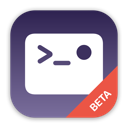
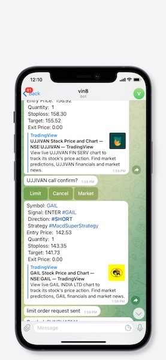
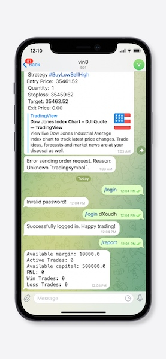
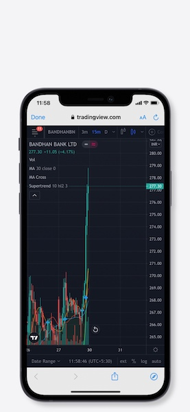

`>_• <./resources/kinetick512.png>`_ Kinetick Trade Bot
=======================================================

\

.. image:: https://img.shields.io/github/checks-status/imvinaypatil/kinetick/main
    :target: https://github.com/imvinaypatil/kinetick
    :alt: Branch state

.. image:: https://img.shields.io/badge/python-3.4+-blue.svg?style=flat
    :target: https://pypi.python.org/pypi/kinetick
    :alt: Python version

.. image:: https://img.shields.io/pypi/v/kinetick.svg?maxAge=60
    :target: https://pypi.python.org/pypi/kinetick
    :alt: PyPi version

.. image:: https://img.shields.io/discord/881151290741256212?logo=discord
    :target: https://discord.gg/VhQ3sddp
    :alt: Chat on Discord

\

    Kinetick is a framework for creating and running trading strategies without worrying
    about integration with broker and data streams (currently integrates with zerodha [*]_).
    Kinetick is aimed to make systematic trading available for everyone.

Leave the heavy lifting to kinetick so that you can focus on building strategies.

`Changelog » <./CHANGELOG.rst>`_

📱 Screenshots
==============

+-----------+-----------+-----------+
| |screen1| | |screen2| | |screen3| |
+-----------+-----------+-----------+

Features
========

- A continuously-running Blotter that lets you capture market data even when your algos aren't running.
- Tick, Bar and Trade data is stored in MongoDB for later analysis and backtesting.
- Using pub/sub architecture using `ØMQ <http://zeromq.org>`_ (ZeroMQ) for communicating between the Algo and the Blotter allows for a single Blotter/multiple Algos running on the same machine.
- **Support for Order Book, Quote, Time, Tick or Volume based strategy resolutions**.
- Includes many common indicators that you can seamlessly use in your algorithm.
- **Market data events use asynchronous, non-blocking architecture**.
- Realtime alerts and order confirmation delivered to your mobile via Telegram bot (requires a `Telegram bot <https://t.me/botfather>`_ token).
- Full integration with `TA-Lib <https://pypi.org/project/TA-Lib/>`_ via dedicated module (`see example <strategies/macd_super_strategy.py>`_).
- Ability to import any Python library (such as `scikit-learn <http://scikit-learn.org>`_ or `TensorFlow <https://www.tensorflow.org>`_) to use them in your algorithms.
- Live charts powered by TradingView
- **RiskAssessor** to manage and limit the risk even if strategy goes unexpected
- Power packed batteries included
- Deploy wherever `Docker <https://www.docker.com>`_ lives

-----

Installation
============

Install using ``pip``:

.. code:: bash

    $ pip install kinetick

Quickstart
==========

There are 5 main components in Kinetick:

1. ``Bot`` - sends alert and signals with actions to perform.
2. ``Blotter`` - handles market data retrieval and processing.
3. ``Broker`` - sends and process orders/positions (abstracted layer).
4. ``Algo`` - (sub-class of ``Broker``) communicates with the ``Blotter`` to pass market data to your strategies, and process/positions orders via ``Broker``.
5. Lastly, **Your Strategies**, which are sub-classes of ``Algo``, handle the trading logic/rules. This is where you'll write most of your code.

1. Get Market Data
------------------

To get started, you need to first create a Blotter script:

.. code:: python

    # blotter.py
    from kinetick.blotter import Blotter

    class MainBlotter(Blotter):
        pass # we just need the name

    if __name__ == "__main__":
        blotter = MainBlotter()
        blotter.run()

Then run the Blotter from the command line:

.. code:: bash

    $ python -m blotter

If your strategy needs order book / market depth data, add the ``--orderbook`` flag to the command:

.. code:: bash

    $ python -m blotter --orderbook

2. Write your Algorithm
-----------------------

While the Blotter running in the background, write and execute your algorithm:

.. code:: python

    # strategy.py
    from kinetick.algo import Algo

    class CrossOver(Algo):

        def on_start(self):
            pass

        def on_fill(self, instrument, order):
            pass

        def on_quote(self, instrument):
            pass

        def on_orderbook(self, instrument):
            pass

        def on_tick(self, instrument):
            pass

        def on_bar(self, instrument):
            # get instrument history
            bars = instrument.get_bars(window=100)

            # or get all instruments history
            # bars = self.bars[-20:]

            # skip first 20 days to get full windows
            if len(bars) < 20:
                return

            # compute averages using internal rolling_mean
            bars['short_ma'] = bars['close'].rolling(window=10).mean()
            bars['long_ma']  = bars['close'].rolling(window=20).mean()

            # get current position data
            positions = instrument.get_positions()

            # trading logic - entry signal
            if bars['short_ma'].crossed_above(bars['long_ma'])[-1]:
                if not instrument.pending_orders and positions["position"] == 0:

                    """ buy one contract.
                     WARNING: buy or order instrument methods will bypass bot and risk assessor.
                     Instead, It is advised to use create_position, open_position and close_position instrument methods
                     to route the order via bot and risk assessor. """
                    instrument.buy(1)

                    # record values for later analysis
                    self.record(ma_cross=1)

            # trading logic - exit signal
            elif bars['short_ma'].crossed_below(bars['long_ma'])[-1]:
                if positions["position"] != 0:

                    # exit / flatten position
                    instrument.exit()

                    # record values for later analysis
                    self.record(ma_cross=-1)

    if __name__ == "__main__":
        strategy = CrossOver(
            instruments = ['ACC', 'SBIN'], # scrip symbols
            resolution  = "1T", # Pandas resolution (use "K" for tick bars)
            tick_window = 20, # no. of ticks to keep
            bar_window  = 5, # no. of bars to keep
            preload     = "1D", # preload 1 day history when starting
            timezone    = "Asia/Calcutta" # convert all ticks/bars to this timezone
        )
        strategy.run()

To run your algo in a **live** environment, from the command line, type:

.. code:: bash

    $ python -m strategy --logpath ~/orders

The resulting trades be saved in ``~/orders/STRATEGY_YYYYMMDD.csv`` for later analysis.

3. Login to bot
----------------------

While the Strategy running in the background:

  Assuming you have added the telegram bot to your chat

- ``/login <password>`` - password can be found in the strategy console.

commands
--------

- ``/report`` - get overview about trades
- ``/help`` - get help
- ``/resetrms`` - resets RiskAssessor parameters to its initial values.

Configuration
-------------
Can be specified either as env variable or cmdline arg

.. list-table::

   * - Parameter
     - Required?
     - Example
     - Default
     - Description
   * - ``symbols``
     -
     -  symbols=./symbols.csv
     -
     -
   * - ``LOGLEVEL``
     -
     - LOGLEVEL=DEBUG
     - INFO
     -
   * - ``zerodha_user``
     - yes - if live trading
     - zerodha_user=ABCD
     -
     -
   * - ``zerodha_password``
     - yes - if live trading
     - zerodha_password=abcd
     -
     -
   * - ``zerodha_pin``
     - yes - if live trading
     - zerodha_pin=1234
     -
     -
   * - ``BOT_TOKEN``
     - optional
     - BOT_TOKEN=12323:asdcldf..
     -
     - IF not provided then orders will bypass
   * - ``initial_capital``
     - yes
     - initial_capital=10000
     - 1000
     - Max capital deployed
   * - ``initial_margin``
     - yes
     - initial_margin=1000
     - 100
     - Not to be mistaken with broker margin. This is the max amount you can afford to loose
   * - ``risk2reward``
     - yes
     - risk2reward=1.2
     - 1
     - Set risk2reward for your strategy. This will be used in determining qty to trade
   * - ``risk_per_trade``
     - yes
     - risk_per_trade=200
     - 100
     - Risk you can afford with each trade
   * - ``max_trades``
     - yes
     - max_trades=2
     - 1
     - Max allowed concurrent positions
   * - ``dbport``
     -
     - dbport=27017
     - 27017
     -
   * - ``dbhost``
     -
     - dbhost=localhost
     - localhost
     -
   * - ``dbuser``
     -
     - dbuser=user
     -
     -
   * - ``dbpassword``
     -
     - dbpassword=pass
     -
     -
   * - ``dbname``
     -
     - dbname=kinetick
     - kinetick
     -
   * - ``orderbook``
     -
     - orderbook=true
     - false
     - Enable orderbook stream
   * - ``resolution``
     -
     - resolution=1m
     - 1
     - Min Bar interval
   * - ``preload_positions``
     - No
     - preload_positions=30D
     - -
     - Loads only overnight positions.Available options: 1D - 1 Day, 1W - 1 Week, 1H - 1 Hour
   * - ``CHAT_ID``
     - No
     - CHAT_ID=12345
     - -
     - default chat user id to which trade notifications are sent requiring no login

Docker Instructions
===================

1. Build blotter

    ``$ docker build -t kinetick:blotter -f blotter.Dockerfile .``

2. Build strategy

    ``$ docker build -t kinetick:strategy -f strategy.Dockerfile .``

3. Run with docker-compose

    ``$ docker compose up``

Backtesting
===========

.. code:: bash

    $ python -m strategy --start "2021-03-06 00:15:00" --end "2021-03-10 00:15:00" --backtest

.. note::

    To get started checkout the patented BuyLowSellHigh strategy in ``strategies/`` directory.

🙏 Credits
==========

Thanks to @ran aroussi for all his initial work with Qtpylib.
Most of work here is derived from his library

Disclaimer
==========

Kinetick is licensed under the **Apache License, Version 2.0**. A copy of which is included in LICENSE.txt.

All trademarks belong to the respective company and owners. Kinetick is not affiliated to any entity.

.. [*] Kinetick is not affiliated to zerodha.

